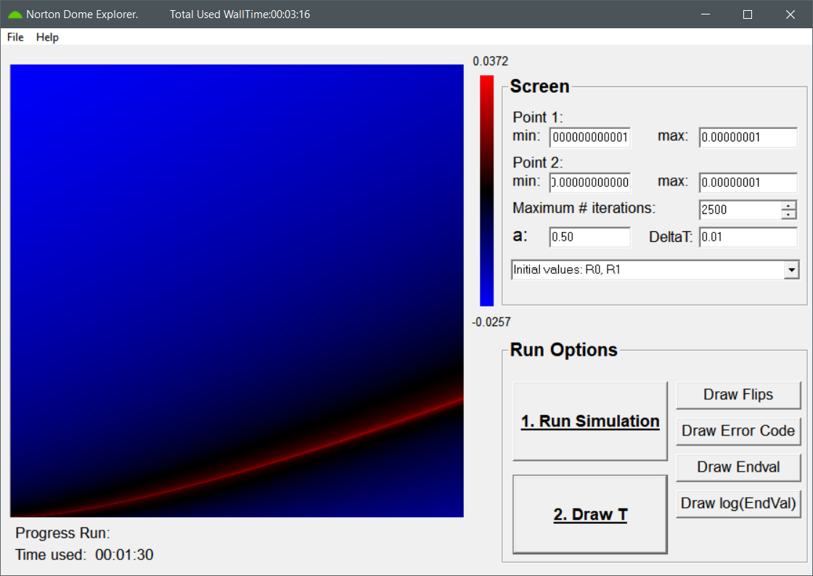

#  NortonDomeExplorer
Classical Newtonian mechanics is generally considered a prime example of a deterministic theory.
It is however possible to construct systems within the confines of Newtonian mechanics which appear to be indeterministic.
The NortonDomeExplorer was developed for the exploration of the discretized version of such an example[\[1\]](#ref_DS1): the dynamics of a point mass on Malament's mounds[\[2\]](#ref_mal), including the special case of Norton's dome[\[3\]](#ref_nort).

The Norton Dome Explorer GUI.

 

### Table of content
   1. [Norton's dome & Malament's Mounds](docs/1_Background.md#background)
      1.1. [Introduction](#background_Intro)
    1.2. [Assigning probabilities](#background_Prob)
    1.3. [Phase Space vector field](#background_Phase)
  2. [Usage](#)
    2.1. [Installation](#)
    2.2. [Users manual](#)
  3. [References](#)
  4. [Acknowledgment](#)

## Usage:

### Installation
* The program can be downloaded as [64bit Windows binary](bin/). Alternatively, it can be compiled 
from the [source](source/DomeExplorer) using a [Delphi-compiler](https://www.embarcadero.com/products/delphi). 
* The support program for generating the vector-field of the phase space can be
compiled from the Fortran [source](source/PhaseSpace). The [gnuplot](http://www.gnuplot.info/) script
for generating the animation can be found in the same folder.

### Running the program
1. Start the program
2. In the *Screen* section select:
    * the initial conditions: (R0,R1) or (R0,V0)
    * and set the ranges as Point 1 (R0) and Point 2 (R1 or V0)
    * the a-power of the general Malament-mound formalism 
	   (Norton Dome: a=0.5)
    * the time-step Delta(T)
    * the number of iterations
3. In the *Run Options* section:
	1. press *Run Simulation* (a progress bar shows the progress of the simulation)
    2. press *Draw T* to visualise the delay times for all initial conditions 	

## References
**<a name="ref_DS1">\[1\]</a>** *"Assigning probabilities to non-Lipschitz mechanical systems"*, D. E. P. Vanpoucke and S. Wenmackers, *Chaos* **X**, YY-YY (2021) [ArXiv](https://arxiv.org/abs/2001.10375) 
**<a name="ref_mal">\[2\]</a>** *"Norton's slippery slope"*, D. B. Malament, *Philosophy of Science* **75**, 799-816 (2008) 
**<a name="ref_nort">\[3\]</a>** *"Causation as folk science"*, J. D. Norton, *Philosophers' Imprint* **3** (2003) and
*"The dome: An unexpectedly simple failure of determinism"*, J. D. Norton, *Philosophy of Science* **75**, 786-798 (2008) 
**<a name="ref_nonSA">\[4\]</a>** *"How To Measure The Infinite: Mathematics With Infinite And Infinitesimal Numbers"*, Vieri Benci, Mauro Di Nasso, *World Scientific*, ISBN:978-9812836373 (2019)  

