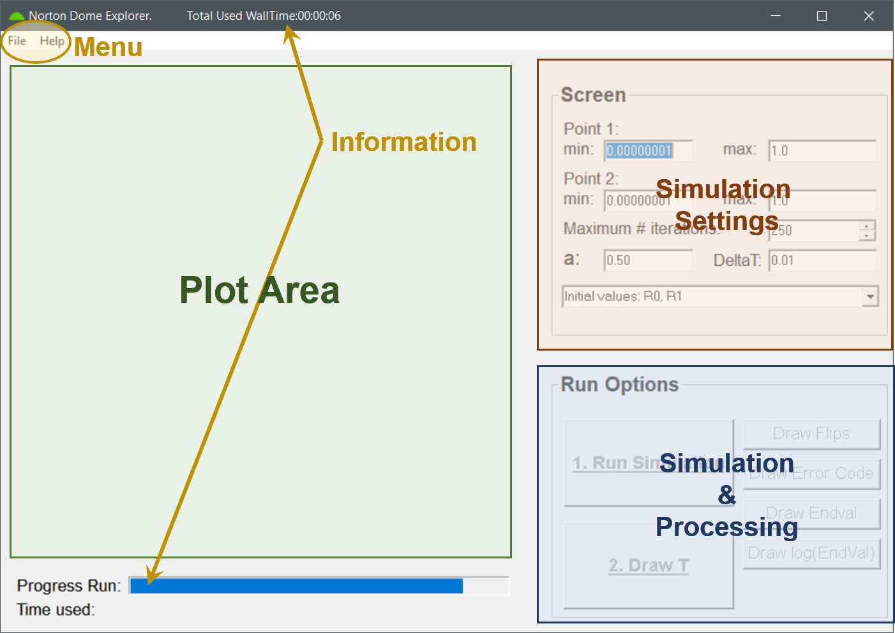
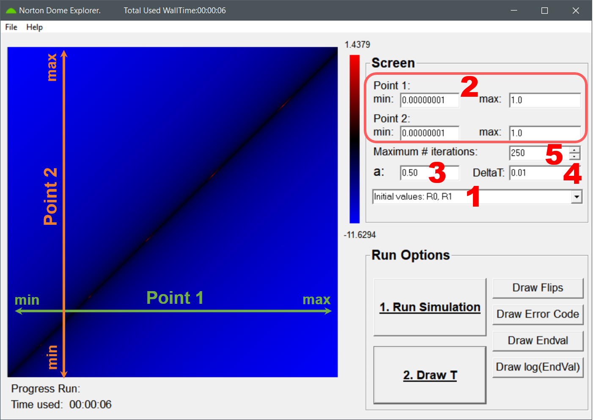
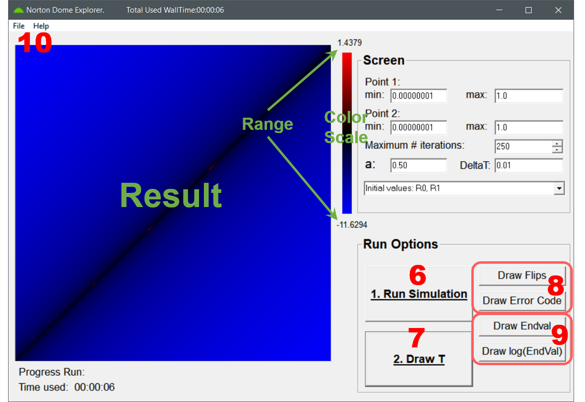

[Back to main page](../README.md)
1. [Installation](#Install) 
    1.1. [Binaries](#InstallBin) 
	1.2. [Source](#InstallSrc) 
2. [Users manual](#ManualND) 
	2.1. [The Interface](#InterfaceND)  
	2.2. [Quick Tutorial: Running the DomeExplorer step by step.](#RunningND)  
	

 
    
[Top](#Top)  

#  1. Installation  

The two programs developed for the paper *"Assigning probabilities to non-Lipschitz mechanical systems"* ,[\[1\]](3_ReferenceList.md#ref_DS1)
can be downloaded from this git repository:
 - **NortonDomeExplorer** An object oriented program written in pascal with a simple GUI, which allows you to investigate the discretized version 
 of the problem (The dynamics of a point-mass placed at in infinitessimal distance from the apex of a Malament's Mound).
 - **PhaseSpace** A small support program written in fortran-95. This can be used to generate the vector-field of the phase space. An additional
 gnuplot script is provided to combine the results into a single animation.

For both programs, 64-bit windows executables are available as well as their source-code. 

##   1.1. Binaries
The binaries are located in the [bin](../bin/) folder of the repository. To install, just download the zipfile and unzip. The programs should 
run out of the box on a recent windows system.

##   1.2. Source
For those interested in the inner workings of the programs, the source is available in the [source](../source/) folder. The programs 
can be compiled from source as well.
### 1.2.1. DomeExplorer
The DomeExplorer was originally developed using the [Borland Delphi-compiler](https://www.embarcadero.com/products/delphi). 
Since then the code ported to Free Pascal using the free [Lazarus IDE](https://www.lazarus-ide.org/), and the provided source and 
support files are should make it easy for compilation with Lazarus. (In theory, the source should still be compatible with Delphi 
as we retained the delphi format-file for the main form.)  
* Download all files in the [source](../source/DomeExplorer/) directory to a folder of your choice.
* Open de *Dome_v1_5_00.lpi*-file using Lazarus
* In the Lazarus IDE go to **Project** -> **Project Options** and set the **Target platform** options in the 
  **Config and Target** (under **Compiler Options**) to your specific architecture. (If you do not know what to 
  choose, just select **default** and you should be fine.) Save these settings by clicking the **OK** button.
* Compile the program by simply clicking the **Run** button (or F9). 

In case you are using the *Delphi*-compiler, you will need to open the *Dome_v1_5_00.dpr*-file instead. As Delphi 
and Lazarus have slightly different definitions with regard to the positioning of components, the layout of the main 
form may need some final tweaking.

### 1.2.2. PhaseSpace
The PhaseSpace support program is written in fortran-95 and can be compiled with a 
fortran compiler.
* Download the [source file](../source/PhaseSpace/PhaseSpace.f95)
* Open in your favourite coding environment such as [Code::Blocks](https://www.codeblocks.org/) 
or [Visual Studio Code](https://code.visualstudio.com/) where you have a fortran compiler available.
* Compile and run the program.
For post-processing the results into an animated gif, download the associated 
[gnuplot script](../source/PhaseSpace/plotVector_animate.gpl) and run in with 
your [gnuplot](http://www.gnuplot.info/) installation.

 
    
[Top](#Top)  

#  2. Running the DomeExplorer program

##  2.1. Graphical User Interface

Different parts of the DomeExplorer GUI.

The DomeExplorer comes with a simple Graphical User interface (GUI), which allows one to setup and run simulations, 
as well as, evaluate and store the results. The GUI contains three major parts:
 1. <b> Simulation Settings : </b> In this panel, specific details of the impending simulation are defined. (*cf.* [Tutorial](#RunningND) 
 for the specific settings and our [paper](3_ReferenceList.md#ref_DS1) for further details.)
 2. ** Simulation & Processing : ** This panel contains a set of buttons related to both running the simulation and presenting
 the results.
 3. ** Plot Area :** The results are graphically presented on the screen in this part. A color scale is included, showing the range
 of values presented.
 4. ** Menu :** The picture of the results presented in the *Plot Area* can be saved as an image via **File -> Save Image**, 
 and the program can be terminated either via **File -> Exit Program** or through the close button. The **Help** menu provides access to 
 these online github information pages. 
 5. ** Information :** Depending on the simulation settings, running the simulation may take a while. To provide a visual feedback to the 
 user (showing the program did not get stuck), a progressbar is provided at the bottom of the *Plot Area*. The time used for the last 
 run simulation is presented below, while the total time for all simulations run in the current session is shown at the top of the screen.

##  2.2. Quick Tutorial: Running the DomeExplorer step by step.

With the DomeExplorer, the phase space of initial values for the different Malament-mounds can be explored. In [our paper](3_ReferenceList.md#ref_DS1),
we discuss how the *real space* finite difference approach implemented in the DomeExplorer provides insight in the *infinitessimal* phase space 
of our &alpha;-theory based model of the dynamics on the mounds. In the short tutorial below, all simulations settings will be discussed. With this 
you will be able to run your own simulations, to either verify the results presented in [the paper](3_ReferenceList.md#ref_DS1) or perform your own
investigation into the specifics of the dynamics on Malament-mounds.  

Setting up a simulation using the DomeExplorer GUI.

### 2.2.1. Setting up a simulation.
All settings of a simulation can be found on the *simulation settings panel*, as indicated in the figure above.
 1. ** Initial values :** The two initial conditions of the Cauchy problem at hand can be formulated in two ways. Either as the
 position at time *t=0* and the position after a first timestep (option **R0,R1**, or using the notation of the paper: **Rn,0,Rn,1**), or 
 as the position and velocity at *T=0* (option **R0,V0**). 
 Depending on the selection, the recurrence relation given in [equation 4](3_ReferenceList.md#ref_DS1): 
 Rn(m) = Rn(m-1)a/n2 + 2 Rn(m-1) - Rn(m-2), is initialised by two 
 initial positions directly, or an initial position and a velocity, which is transformed into two initial positions. In practice, for both modes the
 same recurrence relation is solved, however, the graphical representation in the *Plot Area* will either present initial pairs **(R0,R1)** or **(R0,V0)**
 depending on the mode.  
 2. ** Point 1/2 minimum and maximum values :** The DomeExplorer evaluates the recurrence relation for each initial value pair corresponding with a single 
 pixel in the 500x500 pixel *Plot Area* (*i.e.* 250 000 initial value pairs are considered). *Point 1* refers to **R0**, while *Point 2* refers to either **R1** or **V0**.
 For each pixel, the initial value pair is calculated as a linear 
 grid ranging in \[min,max\], as provided by the user. **Note:** As the pair **(R0,R1)=(0,0)** is the singular solution of the Cauchy problem, and the only point 
 with an infinite T value (or within the context of the DomeExplorer a value of DeltaT\*(Maximum \# Iterations) ), it is best to explicitly exclude it from the 
 simulations as it will dominate the color scale, and one ends up with a black *Plot Area* with a single red pixel.
 3. ** "a" value :** The power in the Cauchy problem of the Malament-mound, given by [equation 1](3_ReferenceList.md#ref_DS1). Values are limited to the 
 range \[0,1\]. The special case of the Norton Dome is recovered by setting **a=0.5** 
 4. ** DeltaT :** This is the discrete time step (also *1/n*, *cf.* [paper](3_ReferenceList.md#ref_DS1)) used in the recurrence relation. When modifying this
 timestep it is important to note that there exists a scaling relation between the timestep **Rn** values: n-2/(1-a). In practice this means that 
 for the Norton Dome (a=1/2), if one reduces DeltaT by a factor of 10 and the maximum **R0,R1** values by a factor of 10 000, the exact same picture is obtained.
 5. ** Maximum \# Iterations :** The maximum number of iterations of the recurrence relation that are being calculated. Higher values provide a more accurate estimate 
 of the *delay time* **T**, corresponding to the time the mass starts sliding of the mound. 
 

Running the simulation and selecting the results to present using the DomeExplorer GUI.

### 2.2.2. Running the simulation.
Once the settings are selected, the simulation can be run, and results visualised using the buttons present on the *Simulation and Processing* Panel.
  6. **Run Simulation :** Pressing this button starts the simulation. Progess of the simulation can be tracked via the progressbar.
  7. **Draw T :** Once the simulation has finished (The "*Time used*" will be shown, and the *Plot Area* will turn into a grey square.) the results for the  
  *delay time* **T** can be visualised by pressing this button. The *color scale* indicates the largest and smallest values obtained in the entire presented
  phase space.
  8. **Draw Flips/Draw Error Code :** Support functionality which for each pixel indicates how many times the path starting with these initial conditions 
  crosses the apex(**Flips**) or if any numerical errors were encountered(**Error Code**: 0=No error, 1=Division by zero, 2=Overflow, 3=Invalid operation, 4=Endposition >1060) 
  9. **Draw Endval/log(EndVal) :** Plot the final position (or log thereof) of a path starting with the initial conditions as given by the pixel.
  10. **File->Save Image :** The image presented in the *Plot Area* can be saved as an image.

